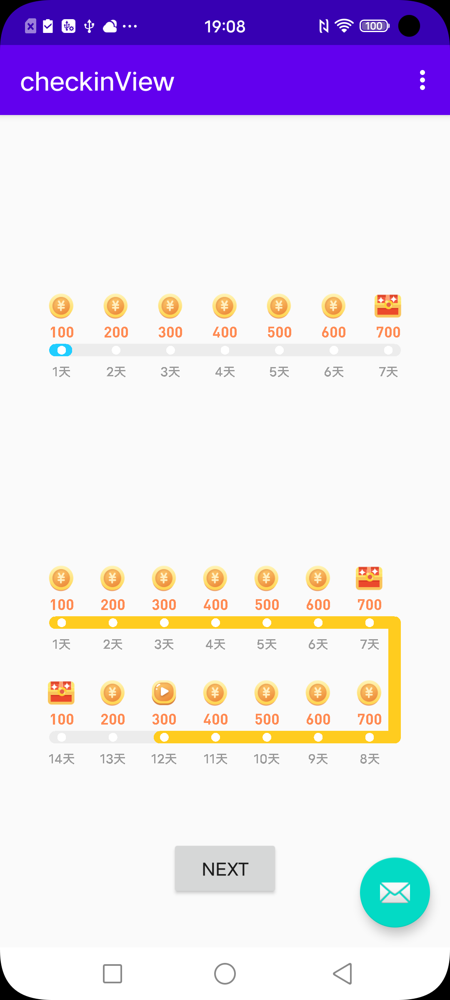

# StepView
stepview 是一个自定义签到 View。

## 预览
                   


## 属性定义
```xml
<declare-styleable name="StepView">
    <!-- 是否展示双周的签到信息 -->
    <attr name="isBiweekly" format="boolean"/>
    <!-- 未签到线条颜色 -->
    <attr name="defaultLineColor" format="color|reference"/>
    <!-- 已签到线条颜色 -->
    <attr name="activeLineColor" format="color|reference"/>
    <!-- 默认金币图标 -->
    <attr name="defaultBonusIcon" format="reference"/>
    <!-- 当前签到看视频图标 -->
    <attr name="currentBonusIcon" format="reference" />
    <!-- 签到额外奖励图标 -->
    <attr name="addedBonusIcon" format="reference" />
</declare-styleable>
```

## 用法
```xml
<com.mophsic.checkinview.StepView
    android:id="@+id/checkInView"
    android:layout_width="match_parent"
    android:layout_height="200dp"
    android:layout_marginBottom="30dp"
    android:paddingStart="15.5dp"
    android:paddingEnd="15.5dp"
    android:paddingTop="21dp"
    android:paddingBottom="18dp"
    android:layout_marginStart="28.5dp"
    android:layout_marginEnd="28.5dp"
    app:isBiweekly="true"
    app:defaultBonusIcon="@mipmap/dialog_checkin_gold"
    app:currentBonusIcon="@mipmap/dialog_checkin_video"
    app:addedBonusIcon="@mipmap/dialog_checkin_box"
    app:layout_constraintLeft_toLeftOf="parent"
    app:layout_constraintRight_toRightOf="parent"
    app:layout_constraintTop_toBottomOf="@id/checkInView2"
    app:layout_constraintBottom_toBottomOf="parent"
    />
```

在java中调用
```kotlin
// 第一行签到信息
checkInView.firstSevenDay = listOf(
    Bonus(1, 100),
    Bonus(2, 200),
    Bonus(3, 300),
    Bonus(4, 400),
    Bonus(5, 500),
    Bonus(6, 600),
    Bonus(7, 700)
)

// 第二行签到信息
checkInView.nextSevenDay = listOf(
    Bonus(8, 700),
    Bonus(9, 600),
    Bonus(10, 500),
    Bonus(11, 400),
    Bonus(12, 300),
    Bonus(13, 200),
    Bonus(14, 100)
)

checkInView.currentDay = 3

checkInView2.firstSevenDay = listOf(
    Bonus(1, 100),
    Bonus(2, 200),
    Bonus(3, 300),
    Bonus(4, 400),
    Bonus(5, 500),
    Bonus(6, 600),
    Bonus(7, 700)
)

checkInView2.currentDay = 3
```
